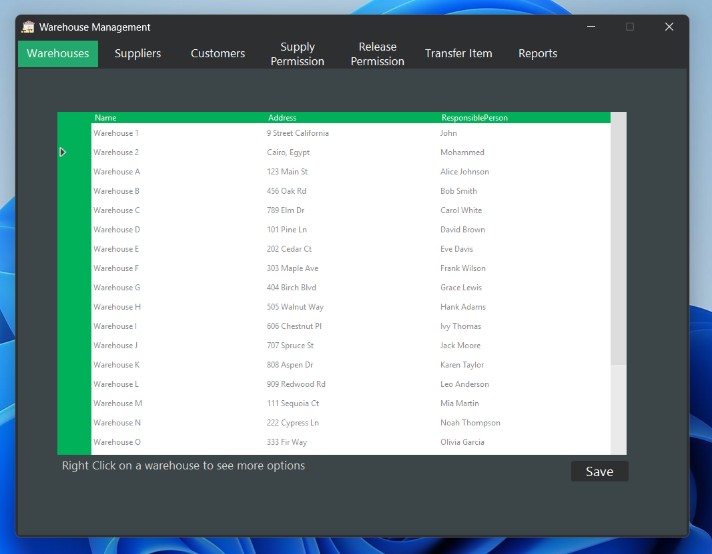
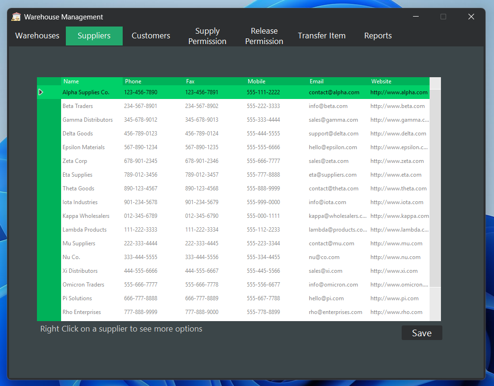
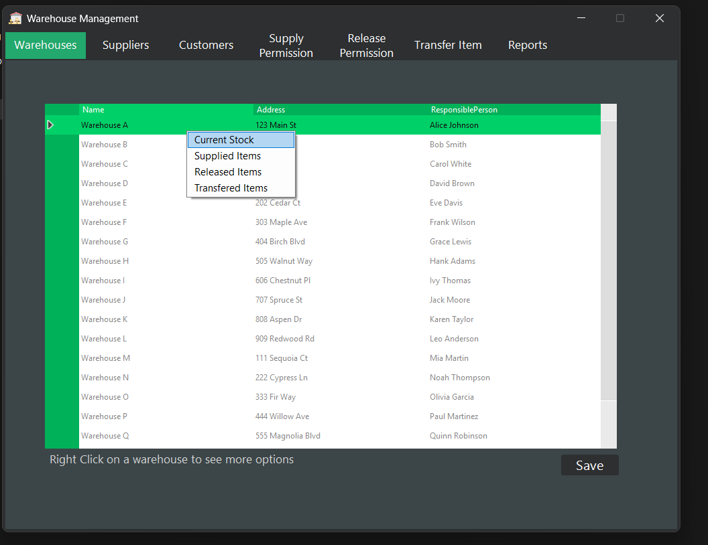
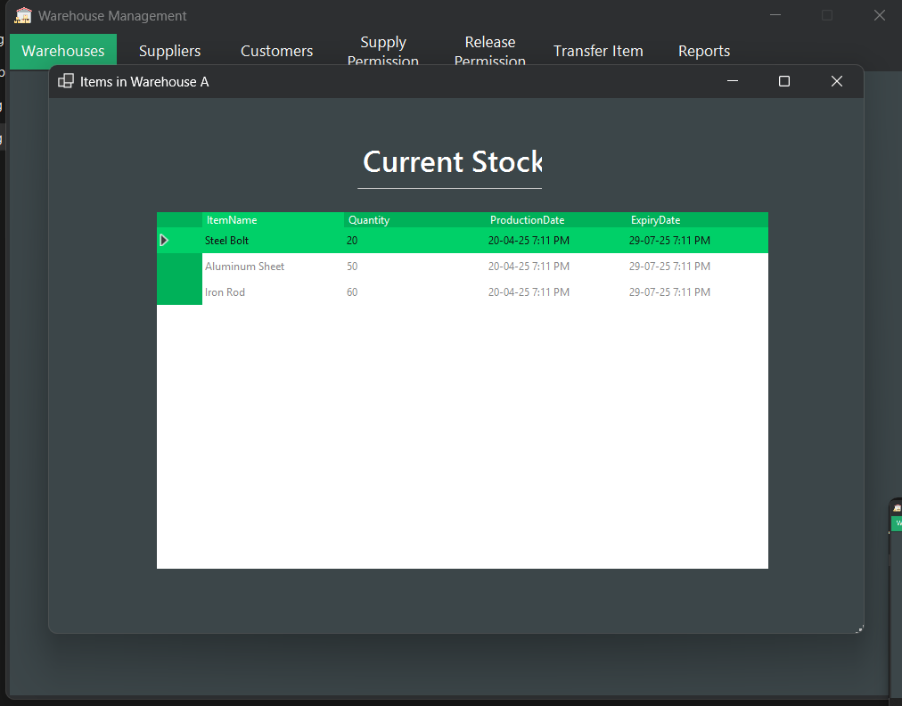
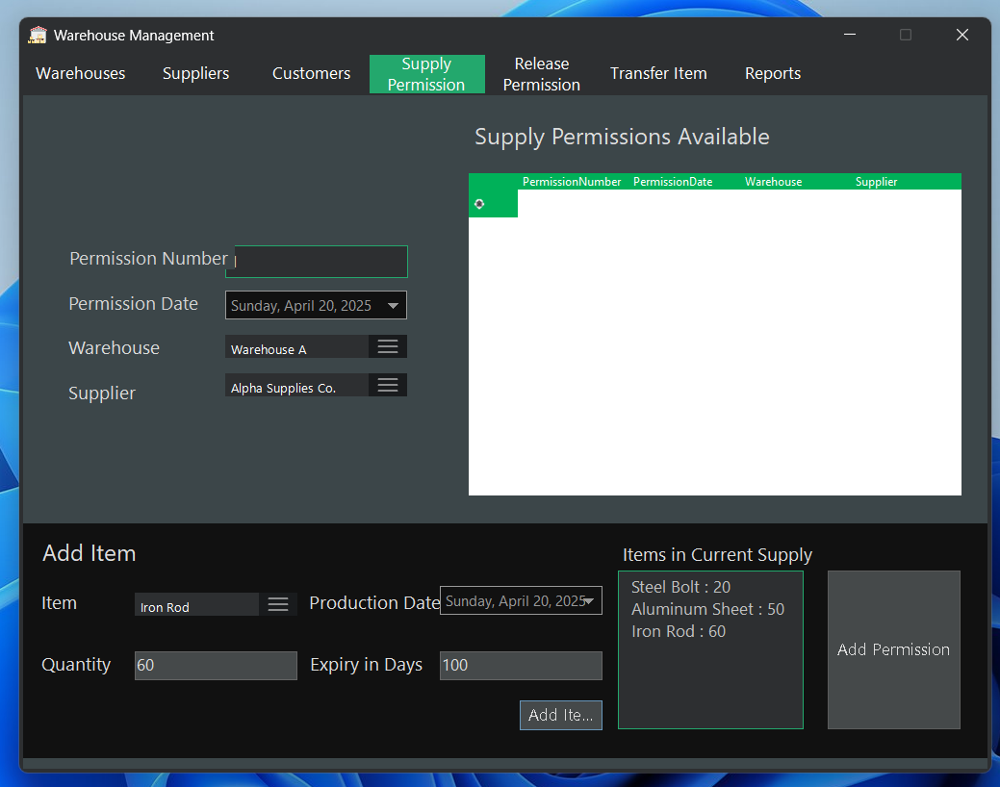
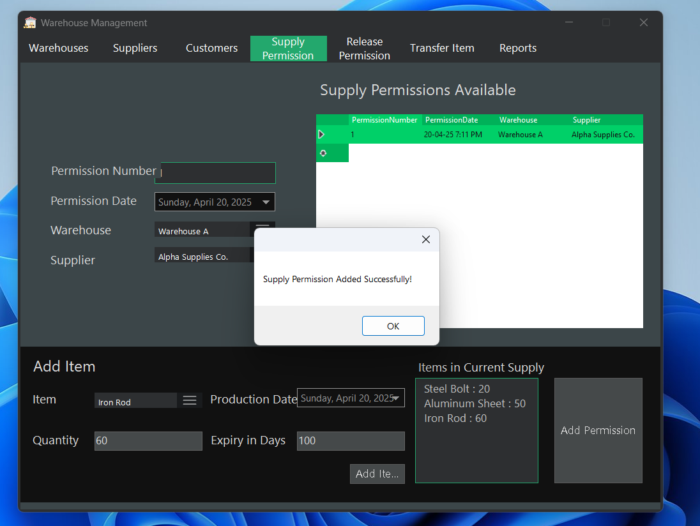
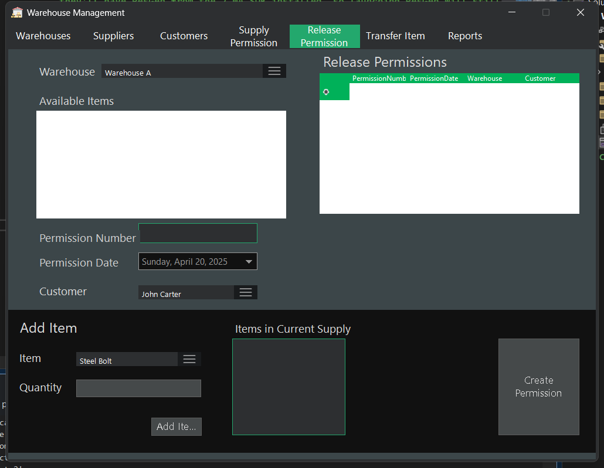
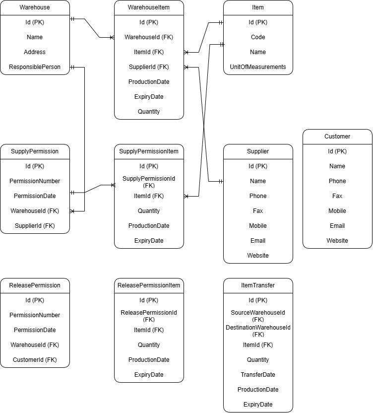

# Warehouse Management System

A comprehensive Windows Forms application for managing commercial company warehouses, inventory, and supply chain operations. Built with .NET 8.0 and Entity Framework Core, this application provides a robust solution for warehouse operations management.

## 📷 Screenshots
### 🏢 Warehouse Management

*Manage multiple warehouses and their inventory*
### 🏢 Supplier Management

*Manage multiple warehouses and their inventory*


### 📦 Inventory Tracking


*Real-time inventory monitoring and management*

### 📋 Supply Permissions


*Supply permission management interface*

### 📤 Release Management

*Release permission and order processing*
## 🌟 Features

### 🏢 Warehouse Management
- Create and manage multiple warehouses
- Track warehouse details and locations
- View warehouse-specific inventory
- Monitor warehouse capacity and utilization

### 📦 Inventory Management
- Track items across multiple warehouses
- Monitor stock levels in real-time
- Track item details including:
  - Production dates
  - Expiry dates
  - Quantities
  - Item codes and descriptions

### 👥 Supplier Management
- Maintain supplier database
- Track supplier information and history
- Manage supplier relationships
- View supplier-specific transactions

### 🛍️ Customer Management
- Customer database management
- Track customer orders and history
- Manage customer relationships
- Monitor customer transactions

### 📋 Supply Permissions
- Create and manage supply permissions
- Track incoming inventory
- Record item details during supply:
  - Quantity
  - Production date
  - Expiry duration
- Link supplies to specific warehouses and suppliers

### 📤 Release Permissions
- Manage inventory release operations
- Track outgoing inventory
- Record release details
- Link releases to customers and warehouses

### 📊 Comprehensive Reporting
Various report types available:
1. **Warehouse Reports**
   - Current inventory levels
   - Stock movements
   - Warehouse utilization

2. **Item Reports**
   - Item movement history
   - Stock levels by item
   - Item transactions

3. **Expiry Reports**
   - Expired items
   - Items nearing expiry
   - Expiry tracking and alerts

4. **Movement Reports**
   - Track item transfers
   - Monitor stock flow
   - Historical movement data

## 🔧 Technical Details

### Built With
- .NET 8.0 Windows Forms
- Entity Framework Core 9.0.2
- Microsoft SQL Server
- ReaLTaiizor 3.8.1.1 (UI Components)

### System Requirements
- Windows Operating System
- .NET 8.0 Runtime
- SQL Server Database

## 🚀 Getting Started

### Prerequisites
1. Install .NET 8.0 SDK or Runtime
2. SQL Server instance
3. Visual Studio 2022 (recommended)

### Installation
1. Clone the repository
2. Open the solution in Visual Studio
3. Update the connection string in your configuration
4. Run Entity Framework migrations:
   ```bash
   dotnet ef database update
   ```
5. Build and run the application

## 🎨 User Interface
- Modern and intuitive interface
- Easy-to-navigate tabs
- Context menus for quick actions
- Responsive data grids
- User-friendly forms

## 💡 Best Practices
- Data integrity checks
- Error handling and validation
- Transaction management
- Audit trailing
- Performance optimization

## 📝 Database Schema

The application uses Entity Framework Code First approach with the following main entities:
- Warehouses
- Items
- Suppliers
- Customers
- SupplyPermissions
- ReleasePermissions
- WarehouseItems
- TransferOperations

[Previous sections remain the same...]

## 📚 Database Schema

### Core Entities

#### 🏢 Warehouse
- `Id` (PK)
- `Name`
- `Address`
- `ResponsiblePerson`
- Relationships:
  - One-to-Many with WarehouseItem
  - One-to-Many with SupplyPermission
  - One-to-Many with ReleasePermission
  - One-to-Many with ItemTransfer (as source and destination)

#### 📦 Item
- `Id` (PK)
- `Code`
- `Name`
- `UnitOfMeasurements`
- Relationships:
  - One-to-Many with WarehouseItem
  - One-to-Many with SupplyPermissionItem
  - One-to-Many with ReleasePermissionItem
  - One-to-Many with ItemTransfer

#### 📋 WarehouseItem
- `Id` (PK)
- `WarehouseId` (FK)
- `ItemId` (FK)
- `SupplierId` (FK)
- `ProductionDate`
- `ExpiryDate`
- `Quantity`

### Supply Management

#### 📥 SupplyPermission
- `Id` (PK)
- `PermissionNumber`
- `PermissionDate`
- `WarehouseId` (FK)
- `SupplierId` (FK)
- Relationships:
  - One-to-Many with SupplyPermissionItem
  - Many-to-One with Warehouse
  - Many-to-One with Supplier

#### 📄 SupplyPermissionItem
- `Id` (PK)
- `SupplyPermissionId` (FK)
- `ItemId` (FK)
- `Quantity`
- `ProductionDate`
- `ExpiryDate`

### Release Management

#### 📤 ReleasePermission
- `Id` (PK)
- `PermissionNumber`
- `PermissionDate`
- `WarehouseId` (FK)
- `CustomerId` (FK)
- Relationships:
  - One-to-Many with ReleasePermissionItem
  - Many-to-One with Warehouse
  - Many-to-One with Customer

#### 📄 ReleasePermissionItem
- `Id` (PK)
- `ReleasePermissionId` (FK)
- `ItemId` (FK)
- `Quantity`
- `ProductionDate`
- `ExpiryDate`

### Transfer Management

#### 🔄 ItemTransfer
- `Id` (PK)
- `SourceWarehouseId` (FK)
- `DestinationWarehouseId` (FK)
- `ItemId` (FK)
- `Quantity`
- `TransferDate`
- `ProductionDate`
- `ExpiryDate`

### Stakeholders

#### 👥 Supplier
- `Id` (PK)
- `Name`
- `Phone`
- `Fax`
- `Mobile`
- `Email`
- `Website`
- Relationships:
  - One-to-Many with SupplyPermission
  - One-to-Many with WarehouseItem

#### 🛍️ Customer
- `Id` (PK)
- `Name`
- `Phone`
- `Fax`
- `Mobile`
- `Email`
- `Website`
- Relationships:
  - One-to-Many with ReleasePermission

### Key Features of the Database Design:

1. **Inventory Tracking**
   - Complete item lifecycle tracking through warehouses
   - Detailed item information including production and expiry dates
   - Multi-warehouse support with transfer capabilities

2. **Permission System**
   - Separate supply and release permission systems
   - Detailed tracking of item movements
   - Full audit trail of transactions

3. **Stakeholder Management**
   - Comprehensive supplier and customer information
   - Contact details and communication channels
   - Transaction history tracking

4. **Data Integrity**
   - Foreign key constraints ensure data consistency
   - Proper relationship management
   - Clear audit trail of all operations


## 📄 License
This project is licensed under the MIT License - see the LICENSE file for details
